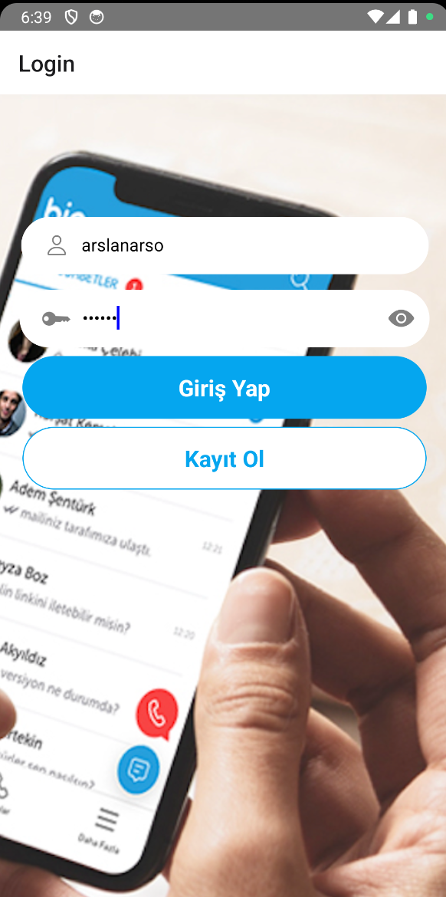
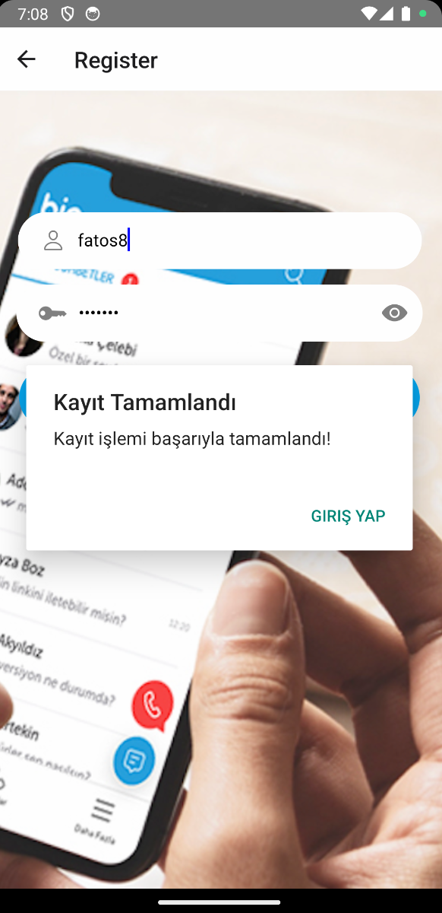
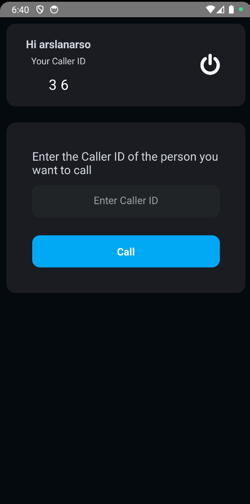
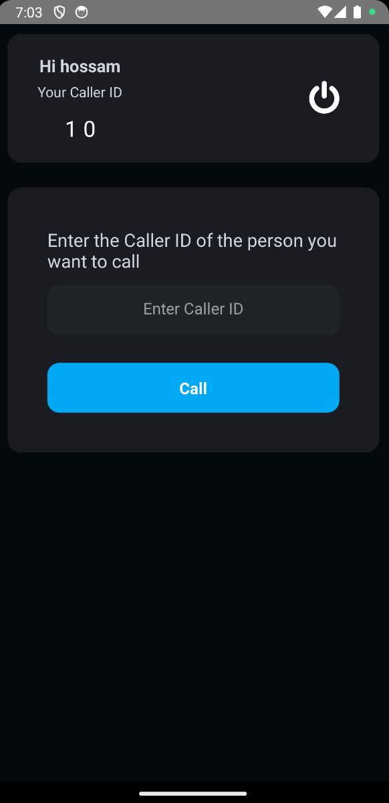
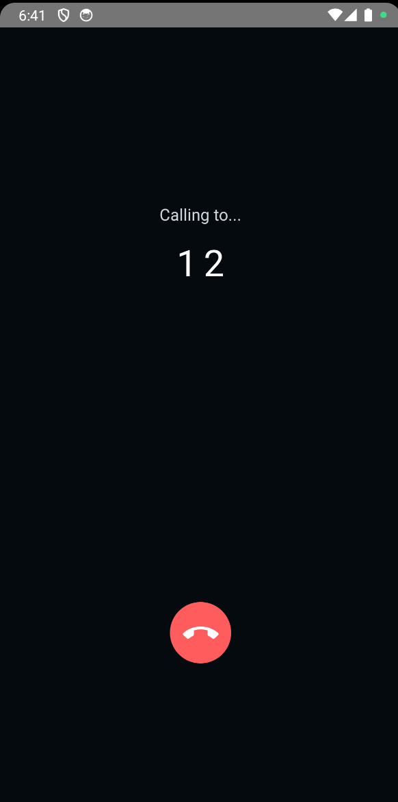
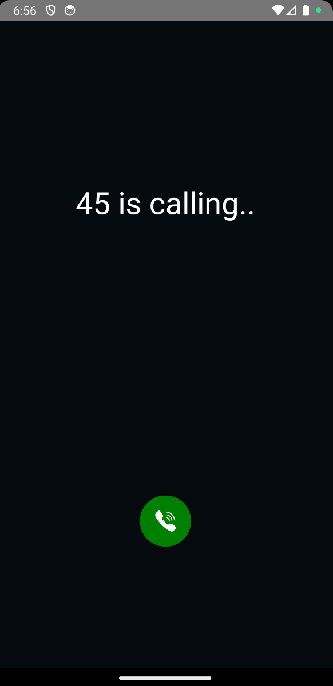
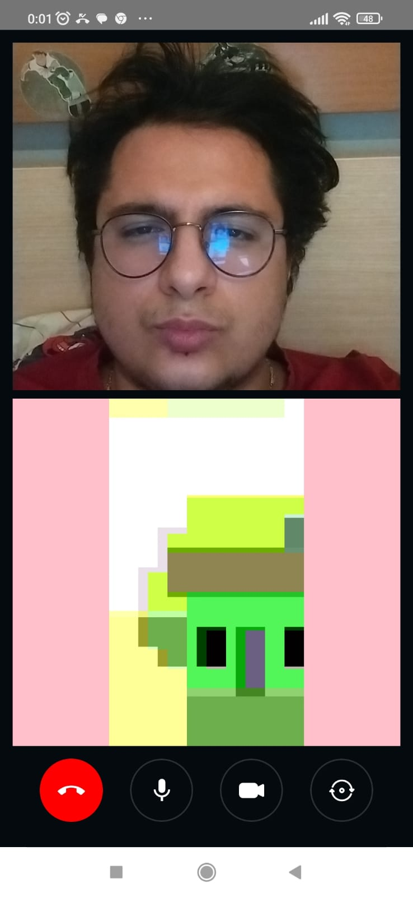

# 🌟 Video Call App with React Native & webRTC & Redux

## Table of Contents 📚

- [About The App](#-about-the-app)
- [Project Structure](#-project-structure)
- [Screenshots](#-screenshots)
- [Technologies](#%EF%B8%8F-technologies)
- [Setup](#-setup-instructions)

## 📱 About The App

This application is a Live Video Chat application developed with **socket.io** on the server side using **webRTC** and **React Native** on the mobile application side.

## 📋 Features

- **Register**: Users can register and make calls by entering the required information.
- **Login**: Registered users can log in to the application to make calls.
- **Caller ID**: Unique ID assigned to individuals.
- **Incoming Screen**: Incoming call screen that appears instantly in incoming calls from the other user.
- **Outgoing Screen**: Outgoing call screen after entering the ID of the person to be called and pressing the call button.
- **Call Screen**: Call screen where both users can talk to each other both voice and video.

## 📁 Project Folder Structure

<pre>
📁 client                  # Mobile Application Developed by React Native
    📁 __tests__               # Test files
    📁 .github
      📁 workflows             # GitHub Actions workflows
    📁 src                     # Source code
       📁 assets               # Application assets
       📁 components           # Reusable components
       📁 Redux                # Redux related files
       📁 Route                # Navigation routes
       📁 Views                # Main application views
       📁 components           # Reusable components
    📜 .eslintignore           # ESLint ignore file
    📜 .eslintrc.js            # ESLint configuration
    📁 .gitignore              # Git ignore file
    📜 app.json                # Application configuration
    📜 App.jsx                 # Main application entry point
    📜 babel.config.js         # Babel configuration
    📜 package.json            # Node.js package configuration
📁 server                  # webRTC server developed by socket.io
    📁 .gitignore              # Git ignore file
    📜 index.js                # Server index file
    📜 socket.js               # configure our socket.io webRTC server
    📜 package.json            # Node.js package configuration
📜 README.md               # Project documentation

</pre>

## 📸 Screenshots

<div align="center">
  
  

</div>

<div align="center">
  
  
</div>

<div align="center">
  
  

</div>
<div align="center">
  

</div>

## 🛠️ Technologies

The mobile app leverages the following key technologies and libraries:

- [**React Native (JavaScript)**](https://reactnative.dev/) 📱

- [**Redux Toolkit**](https://redux-toolkit.js.org/) 🔄

- [**React Navigation**](https://reactnavigation.org/) 📑

- [**Async Storage**](https://github.com/react-native-async-storage/async-storage) 📂

- [**React Native Vector Icons**](https://www.npmjs.com/package/react-native-vector-icons)✨

- [**react-native-svg**](https://www.npmjs.com/package/react-native-svg) 🖼️
- [**react-native-webrtc**](https://www.npmjs.com/package/react-native-webrtc?activeTab=readme) 👋

- [**socket.io-client**](https://www.npmjs.com/package/socket.io-client?activeTab=readme) 📡

- [**socket.io**](https://www.npmjs.com/package/socket.io) 📡

These core technologies, along with others, come together to create a powerful and user-friendly **Video Call App with React Native & webRTC**.

## 🚀 Setup Instructions

Clone the repository to your local environment.

```js
git clone https://github.com/arslanarso/react-native-videocall-webrtc.git
```

### Server Setup 🚀

#### Step 1: Go to server folder

```js

cd react-native-videocall-webrtc/server
```

### 🚚 Install Dependencies

```shell
npm install
```

#### Step 3: Run the project

```js

npm run start
```

---

### Client Setup 🚀

#### Step 1: Go to client folder

```js

cd react-native-videocall-webrtc/client
```

### 🚚 Install Dependencies

```shell
npm install
```

### Step 3: Provide your local Ip address in `SocketIOClient`.

in client/src/index.jsx file, update the Network Ip address.

```js
const socket = SocketIOClient("http://LOCAL_IP_ADDRESS:3500", {});
```

### 🏃‍♀️ Start the Development Server

To run the app in development mode, use the following commands:

#### 🏁 Start Project :

```shell
npm start
```

#### 🍎 iOS Simulator (requires macOS and Xcode):

```shell
npm run ios
```

#### 🤖 Android Emulator (requires Android Studio):

```shell
npm run android
```
